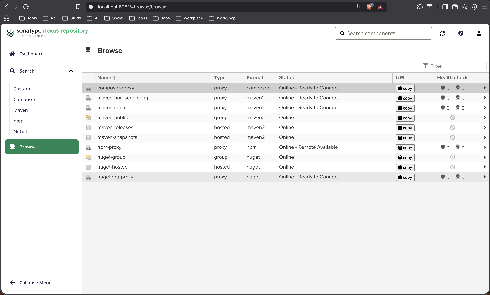

# DevOps Lab Report: Sonatype Nexus Repository Manager

## 1. Introduction

This lab documents deploying Sonatype Nexus Repository Manager 3 with Docker, creating proxy repositories for Composer, npm, and Maven, and configuring a Laravel project to retrieve dependencies through Nexus. The main goal is to centralize package management and cache external artifacts locally.

## 2. Objectives

- Deploy Nexus Repository Manager 3 using Docker Compose.
- Persist Nexus data on the host filesystem.
- Create proxy repositories for Composer, npm, and Maven.
- Configure a Laravel project to use Nexus for Composer, npm, and Maven.
- Verify repository access and caching from local and remote clients.

## 3. Environment

| Tool | Purpose |
| --- | --- |
| Docker / Docker Compose | Run and manage the Nexus container |
| Sonatype Nexus 3 | Artifact repository manager |
| Composer | PHP dependency manager |
| npm | Node.js dependency manager |
| Maven | Java dependency manager |
| Laravel | Test application used to validate proxy access |

## 4. Nexus Docker Setup

The Nexus service was deployed using `docker-compose.yml`:

```yaml
services:
  nexus:
    image: sonatype/nexus3:latest
    container_name: nexus3
    ports:
      - "8081:8081"
    volumes:
      - ./nexus-data:/nexus-data
    restart: always
```

Nexus is available at:

```
http://localhost:8081
```

## 5. Volume Mapping

The container uses a host-mounted volume so Nexus data is preserved when the container stops or is recreated:

```
./nexus-data:/nexus-data
```

## 6. Proxy Repositories

Created proxy repositories:

| Repository Name | Format | Remote Repository |
| --- | --- | --- |
| `composer-proxy` | composer | `https://repo.packagist.org` |
| `npm-proxy` | npm | `https://registry.npmjs.org` |
| `maven-bun-sengleang` | maven2 | `https://repo1.maven.org/maven2/` |

## 7. Laravel Project

The Laravel test project is located in `nexus-lab`.

Important files used in the lab:

- `nexus-lab/composer.json`
- `nexus-lab/package.json`
- `nexus-lab/.npmrc`

## 8. Composer Configuration

Composer was configured to use the Nexus Composer proxy repository and to disable direct Packagist access:

```json
"repositories": [
  { "packagist.org": false },
  {
    "type": "composer",
    "url": "http://localhost:8081/repository/composer-proxy/"
  }
]
```

Composer proxy URL:

```
http://localhost:8081/repository/composer-proxy/
```

Note: Accessing the Composer proxy URL directly in a browser, such as `/repository/composer-proxy/`, returns a 404 error. This is expected because the repository is designed for Composer API access, not direct browsing.

## 9. npm Configuration

npm was configured to use the Nexus npm proxy repository:

```text
registry=http://localhost:8081/repository/npm-proxy/
ignore-scripts=true
audit=false
```

npm proxy URL:

```
http://localhost:8081/repository/npm-proxy/
```

Note: `npm audit` requests may return HTTP 400 when using Nexus. This happens because Nexus does not fully support npm audit endpoints. Disabling audit keeps installation output clean without affecting package downloads.

## 10. Maven Configuration

Maven was configured to use the Nexus Maven proxy repository through `settings.xml`:

```xml
<settings>
  <mirrors>
    <mirror>
      <id>nexus</id>
      <mirrorOf>*</mirrorOf>
      <url>http://localhost:8081/repository/maven-bun-sengleang/</url>
    </mirror>
  </mirrors>
</settings>
```

A test Maven project was built with a dependency such as `junit`. The build successfully downloaded dependencies through Nexus, and the artifacts were cached in the repository.

During the Maven build process, dependency downloads were routed through Nexus instead of Maven Central. This was confirmed by observing requests to the Nexus repository URL in Maven debug output.

Cached Maven artifacts observed in Nexus included examples such as:

- `junit`
- `commons-io`
- `org.apache`

The cached artifacts visible in Nexus confirm that the proxy repository successfully stored downloaded dependencies.

## 11. Evidence

The Nexus Browse page confirms the repositories are online:



Additional verification confirms that all package managers are using Nexus instead of public registries:

- **Composer**: metadata successfully retrieved from Nexus (`packages.json`)
- **npm**: verbose logs show requests sent to the Nexus proxy URL
- **Maven**: dependencies downloaded through the Nexus mirror configuration
- **Caching**: packages appear in the Nexus Browse interface for all repositories

Example checks run on the Nexus host:

```bash
# Composer metadata
curl -sS http://localhost:8081/repository/composer-proxy/packages.json | head -n 5

# npm verification from a client
npm --verbose install some-package 2>&1 | grep "repository/npm-proxy"
```

If you want inline repository screenshots, add the exported images to the project and reference them here, for example `assets/composer-proxy.png`, `assets/npm-proxy.png`, and `assets/maven.png`.

## 12. Summary of Work

- Deployed Nexus 3 with Docker Compose.
- Persisted data in `./nexus-data`.
- Created `composer-proxy`, `npm-proxy`, and `maven-bun-sengleang` proxy repositories.
- Configured a Laravel project to use Nexus for Composer and npm.
- Configured Maven to use the Nexus proxy repository through `settings.xml`.
- Verified repository access and caching from local and remote clients.

## 13. External Access and Partner Verification

Nexus was reachable via the host IP address, for example:

```
http://192.168.1.104:8081
```

Note: When accessing Nexus from another machine, the host IP address must be used instead of `localhost`, since `localhost` refers to the client machine itself.

Partner verification steps used:

```bash
composer config -g secure-http false
```

```bash
composer install
```

```bash
npm config set registry http://192.168.1.104:8081/repository/npm-proxy/
npm install
```

The partner machine also used the Maven mirror URL in `settings.xml` and was able to resolve dependencies through Nexus.

## 14. Conclusion

This lab demonstrates the successful deployment and configuration of Sonatype Nexus Repository Manager as a centralized artifact proxy using Docker.

Proxy repositories for Composer, npm, and Maven were configured and integrated with application environments. Dependency requests were routed through Nexus, and external artifacts were cached locally, improving performance and reliability.

Additionally, the repository was exposed over the local network and verified from a second machine, confirming its usability in a collaborative environment.

This setup reflects a real-world DevOps practice where dependency management is centralized, reproducible, and optimized for team workflows.
